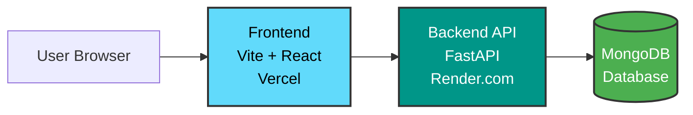
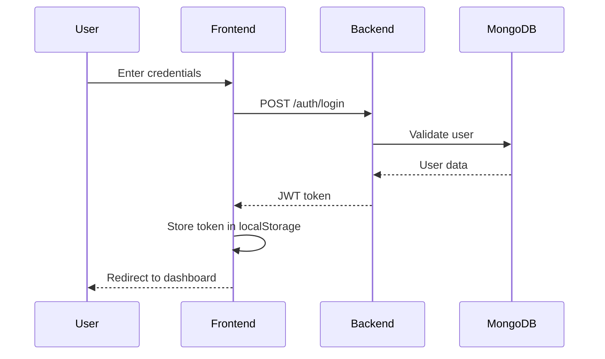
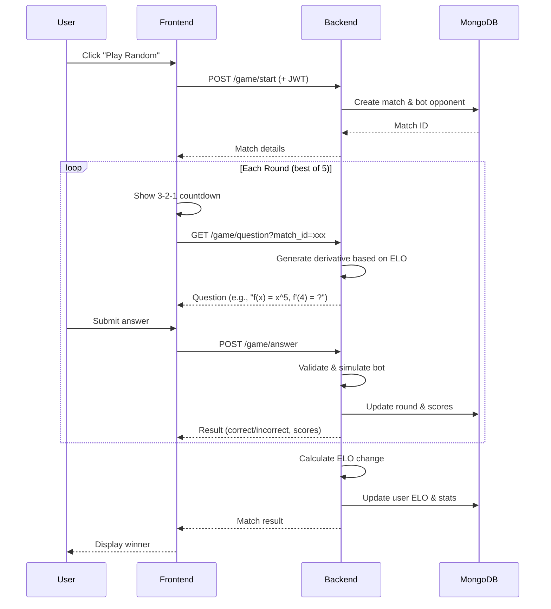

# System Architecture

## Overview

**Derivative Duel** uses a modern, decoupled architecture with a React frontend and Python FastAPI backend. This separation allows independent scaling, deployment, and development of each component.

---

## Architecture Diagram



---

## Component Details

### Frontend (This Repository)

**Deployment:** Vercel  
**URL:** [www.mathbattle.xyz](https://www.mathbattle.xyz)

#### Tech Stack
- **Vite** - Build tool with HMR
- **React 18** - Component-based UI
- **React Router** - Client-side routing
- **Tailwind CSS** - Utility-first styling
- **Framer Motion** - Animation library
- **Axios** - HTTP client with interceptors

#### Key Features
- JWT token management (localStorage)
- Protected routes with auth guards
- Real-time countdown animations
- Responsive design (desktop-first)
- Optimistic UI updates

#### File Structure
```
frontend/src/
├── pages/
│   ├── Home.jsx           # Landing page
│   ├── Login.jsx          # Authentication
│   ├── PlayRandom.jsx     # Random matchmaking
│   ├── PlayFriend.jsx     # Friend matches
│   └── Leaderboard.jsx    # Top players
├── components/
│   ├── Navbar.jsx         # Navigation
│   ├── ProtectedRoute.jsx # Auth guard
│   └── Countdown.jsx      # Animated countdown
├── api.js                 # API client & auth
├── App.jsx               # Router config
└── main.jsx              # Entry point
```

---

### Backend (Separate Repository)

**Deployment:** Render.com  
**Repository:** *[Private - contact for access]*

#### Tech Stack
- **FastAPI** - Modern Python web framework
- **MongoDB** - NoSQL database
- **Motor** - Async MongoDB driver
- **PyJWT** - JWT authentication
- **Bcrypt** - Password hashing
- **SymPy** - Symbolic mathematics for derivatives

#### Key Features
- RESTful API design
- JWT-based authentication
- ELO rating calculation
- Dynamic question generation
- Bot opponent simulation

#### API Endpoints

**Authentication:**
```
POST   /auth/register       # Create account
POST   /auth/login          # Login
GET    /user/profile        # Get user stats (protected)
```

**Game:**
```
POST   /game/start          # Start match
GET    /game/question       # Get question for round
POST   /game/answer         # Submit answer
```

**Leaderboard:**
```
GET    /leaderboard         # Top 10 players
```

---

## Data Flow

### 1. User Authentication



### 2. Game Match Flow



---

## Database Schema

### Users Collection
```javascript
{
  _id: ObjectId,
  email: String (unique, indexed),
  password_hash: String,
  name: String,
  elo: Number (default: 1000, indexed),
  wins: Number (default: 0),
  losses: Number (default: 0),
  created_at: DateTime
}
```

### Matches Collection
```javascript
{
  _id: ObjectId,
  player1_id: ObjectId (ref: User),
  player2_id: ObjectId (ref: User),
  player1_score: Number,
  player2_score: Number,
  rounds: Array[{
    question: String,
    correct_answer: Number,
    player1_answer: Number,
    player2_answer: Number,
    winner: Number (1 or 2)
  }],
  winner_id: ObjectId (ref: User),
  elo_change: Number,
  status: String (enum: 'active', 'completed'),
  created_at: DateTime,
  completed_at: DateTime
}
```

---

## Question Generation Algorithm

1. **Determine Difficulty:**
   - Fetch player's ELO from database
   - Map to difficulty tier (easy/medium/hard)

2. **Generate Polynomial:**
   - Easy: Single term (e.g., `x^2`, `3*x^4`)
   - Medium: 2-3 terms (e.g., `x^5 + 2*x^3`)
   - Hard: 4+ terms (e.g., `x^7 - 4*x^5 + 3*x^3 - 2*x`)

3. **Compute Derivative:**
   - Use SymPy to symbolically differentiate
   - Example: `f(x) = x^5` → `f'(x) = 5*x^4`

4. **Evaluate at Point:**
   - Choose random evaluation point (1-10)
   - Example: `f'(4) = 5 * 4^4 = 1280`

5. **Return Question:**
   ```json
   {
     "question": "f(x) = x^5, find f'(4)",
     "correct_answer": 1280
   }
   ```

---

## ELO Calculation

Uses standard chess ELO formula:

```python
def calculate_elo_change(player_elo, opponent_elo, won, K=32):
    expected_score = 1 / (1 + 10 ** ((opponent_elo - player_elo) / 400))
    actual_score = 1 if won else 0
    elo_change = K * (actual_score - expected_score)
    return round(elo_change)
```

**Example:**
- Player (ELO 1200) beats opponent (ELO 1400)
- Expected score: 0.24 (24% chance to win)
- Actual score: 1 (won)
- ELO change: `32 * (1 - 0.24) = +24`

---

## Security

### Frontend
- JWT tokens stored in `localStorage`
- Axios interceptors attach token to all API requests
- Protected routes redirect to login if unauthenticated
- HTTPS enforced in production (Vercel)

### Backend
- Passwords hashed with Bcrypt (salt rounds: 12)
- JWT tokens with expiration (24 hours)
- CORS configured for frontend domain only
- Input validation on all endpoints
- Rate limiting (100 req/min per IP)

### Database
- MongoDB connection over TLS
- User passwords never stored in plaintext
- Email uniqueness enforced at DB level
- Indexes on frequently queried fields (email, ELO)

---

## Deployment

### Frontend (Vercel)
1. Push to GitHub `master` branch
2. Vercel auto-deploys on push
3. Build command: `npm run build`
4. Output directory: `dist/`
5. Environment variable: `VITE_API_URL`

### Backend (Render.com)
1. Connected to backend Git repository
2. Auto-deploy on push to `main`
3. Build command: `pip install -r requirements.txt`
4. Start command: `uvicorn main:app --host 0.0.0.0 --port 10000`
5. Environment variables: `MONGODB_URL`, `SECRET_KEY`

---

## Performance Optimizations

### Frontend
- Vite's code splitting (React.lazy)
- Tailwind CSS purging (removes unused styles)
- Axios caching for leaderboard
- Optimistic UI updates (show answer feedback immediately)

### Backend
- MongoDB connection pooling (Motor)
- Question generation caching (Redis in future)
- Async endpoints (FastAPI + Motor)
- Lightweight responses (exclude unnecessary fields)

---

## Scalability Considerations

### Current Limitations
- Bot opponent (no real-time multiplayer)
- No WebSocket support
- Single backend instance

### Future Improvements
- **Real-time multiplayer:** Socket.IO or WebSockets
- **Matchmaking queue:** Redis pub/sub
- **Horizontal scaling:** Multiple backend instances with load balancer
- **CDN:** CloudFlare for static assets
- **Database sharding:** MongoDB sharding for millions of users
- **Caching layer:** Redis for leaderboard and questions

---

## Monitoring & Logging

### Frontend
- Vercel Analytics (page views, performance)
- Error boundary for React crashes
- Console logs in development only

### Backend
- Render.com logs (stdout/stderr)
- FastAPI's built-in request logging
- Python logging module for errors
- TODO: Sentry for error tracking

---

## Development Workflow

1. **Local Development:**
   - Frontend: `npm run dev` (port 5173)
   - Backend: `python main.py` (port 8000)
   - MongoDB: Local instance or Atlas free tier

2. **Testing:**
   - Manual testing in browser
   - TODO: Jest for frontend unit tests
   - TODO: Pytest for backend tests

3. **Deployment:**
   - Push to GitHub
   - Vercel auto-deploys frontend
   - Render auto-deploys backend
   - Monitor logs for errors

---

## Tech Stack Justification

| Choice | Reason |
|--------|--------|
| **Vite** | Instant HMR, faster than CRA |
| **React** | Component reusability, large ecosystem |
| **Tailwind** | Rapid prototyping, small bundle size |
| **FastAPI** | Auto-generated docs, async support |
| **MongoDB** | Flexible schema, easy scaling |
| **Vercel** | Zero-config deployment, global CDN |
| **Render.com** | Free tier, easy Python deployment |

---

## Contact

For backend repository access or architecture questions, contact:
- GitHub: [@Skriptiensolmija](https://github.com/Skriptiensolmija)
